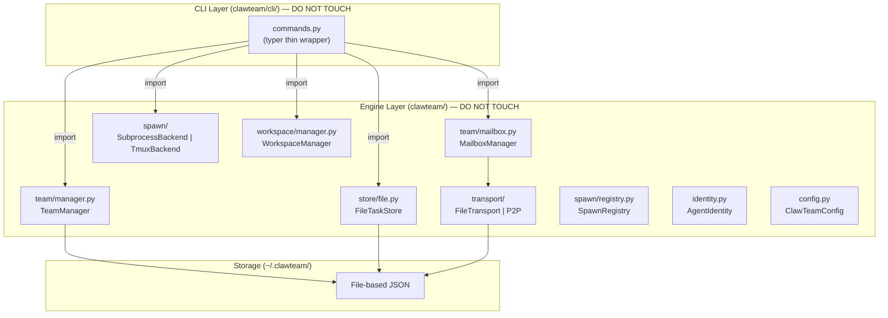
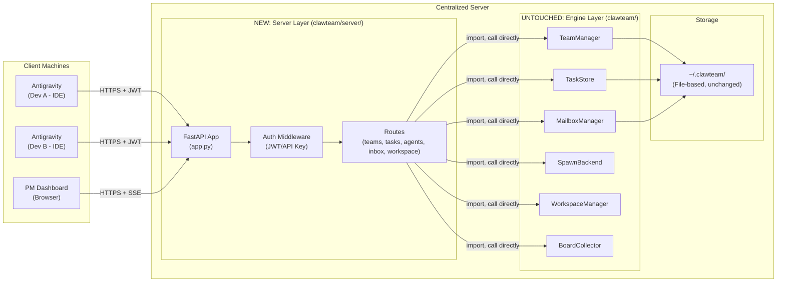
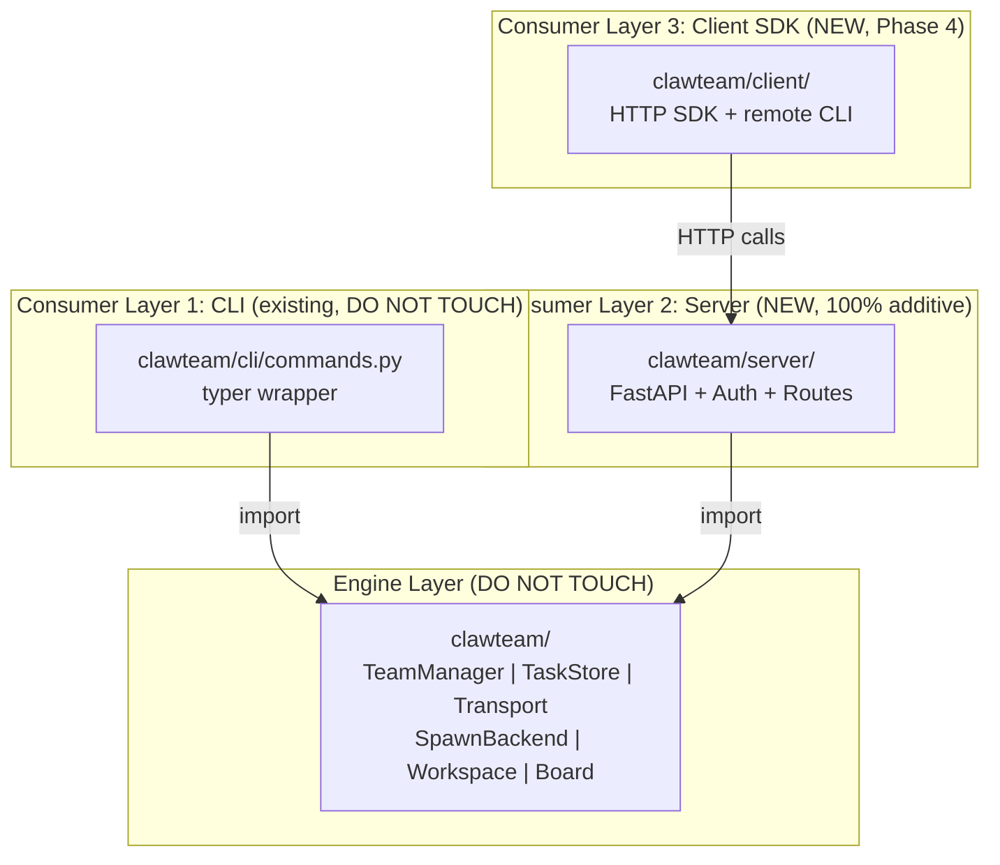

# ClawTeam Server-Client Architecture: Implementation Plan

## Summary

Transform ClawTeam from a **single-machine CLI tool** into a **centralized agents server**:
- **Server**: Centralized machine that runs agents, executes code, commits
- **Client (Antigravity)**: IDE instances of dev/PM team members, issuing commands and monitoring

---

## 🔒 ARCHITECTURE RULE #1

```
THE SERVER LAYER IS 100% NEW CODE.
DO NOT MODIFY, REFACTOR, OR TOUCH EXISTING ENGINE CODE.
The Server only IMPORTS and CALLS existing public APIs from the engine.
```

### Dependency Direction (one-way, never reversed)

```
clawteam/server/  ──import──>  clawteam/ (engine)
clawteam/cli/     ──import──>  clawteam/ (engine)

Engine does NOT know Server exists.
Engine does NOT know CLI exists.
Engine is the core library. CLI and Server are two equal consumers.
```

### File Classification

| Path | Status | Owner |
|------|--------|-------|
| `clawteam/team/` | ❌ DO NOT TOUCH | Engine (existing) |
| `clawteam/store/` | ❌ DO NOT TOUCH | Engine (existing) |
| `clawteam/transport/` | ❌ DO NOT TOUCH | Engine (existing) |
| `clawteam/spawn/` | ❌ DO NOT TOUCH | Engine (existing) |
| `clawteam/workspace/` | ❌ DO NOT TOUCH | Engine (existing) |
| `clawteam/board/` | ❌ DO NOT TOUCH | Engine (existing) |
| `clawteam/cli/` | ❌ DO NOT TOUCH | Engine (existing) |
| `clawteam/config.py` | ❌ DO NOT TOUCH | Engine (existing) |
| `clawteam/identity.py` | ❌ DO NOT TOUCH | Engine (existing) |
| `clawteam/paths.py` | ❌ DO NOT TOUCH | Engine (existing) |
| `clawteam/fileutil.py` | ❌ DO NOT TOUCH | Engine (existing) |
| `clawteam/server/` | ✅ 100% NEW CODE | Server layer (new) |
| `clawteam/client/` | ✅ 100% NEW CODE | Client SDK (new, Phase 4) |

---

## 1. Current Architecture (v0.3) — Engine Layer



### Engine Public API (surfaces the Server will call)

| Module | Class/Function | Methods |
|--------|---------------|---------|
| `team.manager` | `TeamManager` | `.create_team()`, `.get_team()`, `.discover_teams()`, `.add_member()`, `.cleanup()`, `.list_members()` |
| `store.file` | `FileTaskStore` | `.create()`, `.get()`, `.update()`, `.list_tasks()`, `.get_stats()` |
| `store` | `get_task_store()` | Factory — returns appropriate store |
| `team.mailbox` | `MailboxManager` | `.send()`, `.receive()`, `.peek()`, `.broadcast()`, `.get_event_log()` |
| `transport` | `get_transport()` | Factory — returns FileTransport or P2P |
| `spawn.subprocess_backend` | `SubprocessBackend` | `.spawn()`, `.list_running()` |
| `spawn.registry` | functions | `register_agent()`, `is_agent_alive()`, `get_registry()`, `get_agent_health()` |
| `workspace.manager` | `WorkspaceManager` | `.create_workspace()`, `.merge_workspace()`, `.cleanup_workspace()`, `.list_workspaces()` |
| `identity` | `AgentIdentity` | `.from_env()`, `.to_env()` |
| `config` | `ClawTeamConfig` | `load_config()`, `save_config()`, `get_effective()` |
| `board.collector` | `BoardCollector` | `.collect_overview()`, `.collect_team()` |

> These are all the surfaces the Server layer will import. No modifications needed in the engine.

---

## 2. Proposed Architecture: Server Layer



### Code Example — Server route calling engine

```python
# clawteam/server/routes/teams.py (NEW FILE — 100% new code)

from fastapi import APIRouter, Depends, HTTPException
from clawteam.team.manager import TeamManager        # ← import engine
from clawteam.server.auth.middleware import get_user  # ← import server's own auth
from clawteam.server.models.schemas import CreateTeamRequest  # ← server's own models

router = APIRouter(prefix="/api/v1/teams", tags=["teams"])

@router.post("/")
async def create_team(req: CreateTeamRequest, user = Depends(get_user)):
    """Create team — calls TeamManager directly, does NOT modify TeamManager."""
    try:
        config = TeamManager.create_team(
            name=req.name,
            leader_name=req.leader_name,
            leader_id=req.leader_id,
            description=req.description,
            user=user.username,
        )
        return {"status": "created", "team": config.name}
    except ValueError as e:
        raise HTTPException(status_code=400, detail=str(e))

@router.get("/")
async def list_teams(user = Depends(get_user)):
    """List teams — calls TeamManager.discover_teams() directly."""
    return TeamManager.discover_teams()

@router.get("/{team}")
async def get_team(team: str, user = Depends(get_user)):
    """Get team detail — calls TeamManager.get_team() directly."""
    config = TeamManager.get_team(team)
    if not config:
        raise HTTPException(status_code=404, detail=f"Team '{team}' not found")
    return config.model_dump(by_alias=True)
```

---

## 3. File Structure — Add Only, Never Modify

```
clawteam/
├── __init__.py              # ❌ DO NOT TOUCH
├── cli/                     # ❌ DO NOT TOUCH
├── team/                    # ❌ DO NOT TOUCH
├── store/                   # ❌ DO NOT TOUCH
├── transport/               # ❌ DO NOT TOUCH
├── spawn/                   # ❌ DO NOT TOUCH
├── workspace/               # ❌ DO NOT TOUCH
├── board/                   # ❌ DO NOT TOUCH
├── config.py                # ❌ DO NOT TOUCH
├── identity.py              # ❌ DO NOT TOUCH
├── paths.py                 # ❌ DO NOT TOUCH
├── fileutil.py              # ❌ DO NOT TOUCH
│
├── server/                  # ✅ 100% NEW
│   ├── __init__.py
│   ├── app.py               # FastAPI application factory
│   ├── config.py            # Server-specific config (port, host, JWT secret)
│   ├── auth/
│   │   ├── __init__.py
│   │   ├── jwt.py           # JWT token create/verify
│   │   ├── api_key.py       # API key validation
│   │   └── middleware.py    # FastAPI dependency — get_user()
│   ├── routes/
│   │   ├── __init__.py
│   │   ├── teams.py         # /api/v1/teams/*
│   │   ├── tasks.py         # /api/v1/teams/{team}/tasks/*
│   │   ├── inbox.py         # /api/v1/teams/{team}/inbox/*
│   │   ├── agents.py        # /api/v1/teams/{team}/agents/*
│   │   ├── workspace.py     # /api/v1/teams/{team}/workspace/*
│   │   ├── board.py         # /api/v1/board/* (SSE stream)
│   │   └── auth_routes.py   # /api/v1/auth/*
│   └── models/
│       ├── __init__.py
│       └── schemas.py       # Request/Response Pydantic models
│
└── client/                  # ✅ 100% NEW (Phase 4)
    ├── __init__.py
    ├── sdk.py               # HTTP client SDK
    ├── config.py            # server_url, auth_token
    └── commands.py          # Remote-mode CLI commands
```

---

## 4. Migration Path

### Phase 1: Server Layer (v0.4) — 2 sprints

> Add `clawteam/server/` layer. Engine code UNCHANGED. Storage remains file-based.

**Scope**:
- `clawteam/server/app.py` — FastAPI app
- `clawteam/server/auth/` — JWT/API Key authentication
- `clawteam/server/routes/` — REST endpoints for all engine functions
- `clawteam/server/models/` — Request/Response schemas
- CLI command: `clawteam serve` (add 1 new command to CLI)
- Dependencies: `fastapi`, `uvicorn`, `pyjwt` (optional install: `pip install clawteam[server]`)

**CLI → REST Mapping**:

| CLI Command | REST Route | Engine Call |
|-------------|-----------|-------------|
| `clawteam team spawn-team` | `POST /api/v1/teams` | `TeamManager.create_team()` |
| `clawteam team discover` | `GET /api/v1/teams` | `TeamManager.discover_teams()` |
| `clawteam team status` | `GET /api/v1/teams/{team}` | `TeamManager.get_team()` |
| `clawteam team cleanup` | `DELETE /api/v1/teams/{team}` | `TeamManager.cleanup()` |
| `clawteam task create` | `POST /api/v1/teams/{team}/tasks` | `store.create()` |
| `clawteam task list` | `GET /api/v1/teams/{team}/tasks` | `store.list_tasks()` |
| `clawteam task update` | `PATCH /api/v1/teams/{team}/tasks/{id}` | `store.update()` |
| `clawteam task stats` | `GET /api/v1/teams/{team}/tasks/stats` | `store.get_stats()` |
| `clawteam inbox send` | `POST /api/v1/teams/{team}/inbox/{agent}` | `mailbox.send()` |
| `clawteam inbox receive` | `GET /api/v1/teams/{team}/inbox/{agent}` | `mailbox.receive()` |
| `clawteam inbox broadcast` | `POST /api/v1/teams/{team}/broadcast` | `mailbox.broadcast()` |
| `clawteam spawn subprocess` | `POST /api/v1/teams/{team}/agents` | `backend.spawn()` |
| `clawteam board show` | `GET /api/v1/board/{team}` | `collector.collect_team()` |
| `clawteam board serve` | `GET /api/v1/board/{team}/events` (SSE) | `collector.collect_team()` |
| `clawteam workspace merge` | `POST /api/v1/teams/{team}/workspace/{agent}/merge` | `ws_mgr.merge_workspace()` |
| `clawteam cost show` | `GET /api/v1/teams/{team}/costs` | `CostTracker` |

**Deliverables**:
- `clawteam serve --host 0.0.0.0 --port 8000` starts the server
- OpenAPI docs at `/docs`
- JWT authentication
- SSE stream for real-time board

> [!IMPORTANT]
> **Note**: `clawteam serve` is a NEW command added to the CLI. But this command only imports
> and starts `clawteam.server.app` — it **does NOT modify** any logic in `commands.py`.
> Alternatively, without adding to CLI, you can run:
> `uvicorn clawteam.server.app:create_app --factory --host 0.0.0.0`

---

### Phase 2: Remote Store Backends (v0.5) — 2 sprints

> Add NEW store backends. Engine store/transport files remain UNCHANGED.

```
clawteam/server/
├── stores/
│   ├── redis_task.py        # RedisTaskStore (implements BaseTaskStore)
│   └── redis_transport.py   # RedisTransport (implements Transport)
└── config.py                # Server config: CLAWTEAM_SERVER_STORE=redis
```

**How it works**:
- `RedisTaskStore` implements `BaseTaskStore` (engine interface) — **same interface**, different backend
- `RedisTransport` implements `Transport` (engine interface) — **same interface**, different backend
- Server factory selects store/transport based on config
- Engine code **UNCHANGED** — abstract base classes already exist

---

### Phase 3: Remote Spawn + Workspace (v0.6) — 2 sprints

> Add NEW spawn backend for remote execution.

```
clawteam/server/
├── spawn/
│   ├── server_spawn.py      # ServerSpawnManager (wraps SubprocessBackend on server)
│   └── container_spawn.py   # DockerSpawnBackend (optional, implements SpawnBackend)
└── workspace/
    └── remote_workspace.py  # Remote git operations wrapper
```

---

### Phase 4: Client SDK (v0.7–v1.0) — 2 sprints

> Add `clawteam/client/` — client calls server via HTTP instead of engine directly.

```
clawteam/client/
├── sdk.py           # ClawTeamClient(server_url, token)
├── config.py        # client config: server_url, auth_token
└── commands.py      # CLI commands using SDK (remote mode)
```

**Dual-mode CLI**:
```
clawteam team discover
  → if server_url configured → HTTP GET /api/v1/teams (remote)
  → else → TeamManager.discover_teams() (local, as today)
```

---

## 5. API Design

```
# Auth
POST   /api/v1/auth/login                          # Get JWT token
POST   /api/v1/auth/refresh                         # Refresh token
GET    /api/v1/auth/me                              # Current user

# Teams
POST   /api/v1/teams                                # Create team
GET    /api/v1/teams                                # List teams
GET    /api/v1/teams/{team}                         # Get team
DELETE /api/v1/teams/{team}                         # Cleanup team

# Tasks
POST   /api/v1/teams/{team}/tasks                   # Create task
GET    /api/v1/teams/{team}/tasks                   # List tasks (?status=&owner=)
PATCH  /api/v1/teams/{team}/tasks/{id}              # Update task
GET    /api/v1/teams/{team}/tasks/stats             # Task stats

# Agents
POST   /api/v1/teams/{team}/agents                  # Spawn agent
GET    /api/v1/teams/{team}/agents                  # List agents
DELETE /api/v1/teams/{team}/agents/{name}           # Kill agent
GET    /api/v1/teams/{team}/agents/{name}/health    # Agent health

# Messaging
POST   /api/v1/teams/{team}/inbox/{agent}           # Send message
GET    /api/v1/teams/{team}/inbox/{agent}           # Receive messages
POST   /api/v1/teams/{team}/broadcast               # Broadcast
GET    /api/v1/teams/{team}/inbox/{agent}/peek      # Peek messages

# Workspace
POST   /api/v1/teams/{team}/workspace/{agent}        # Create workspace
POST   /api/v1/teams/{team}/workspace/{agent}/merge  # Merge
GET    /api/v1/teams/{team}/workspace/{agent}/diff   # View diff
GET    /api/v1/teams/{team}/workspaces               # List workspaces

# Board (real-time)
GET    /api/v1/board/overview                        # All teams
GET    /api/v1/board/{team}                          # Team snapshot
GET    /api/v1/board/{team}/events                   # SSE stream

# Costs
GET    /api/v1/teams/{team}/costs                    # Cost tracking
```

---

## 6. Overall Diagram — 3 Consumer Layers



---

## 7. Effort Summary

| Phase | Scope | New files | Engine changes | Effort |
|-------|-------|-----------|---------------|--------|
| Phase 1: Server Layer | FastAPI + Auth + Routes | ~12 files | **ZERO** | 2 sprints |
| Phase 2: Remote Store | Redis backends | ~3 files | **ZERO** | 2 sprints |
| Phase 3: Remote Spawn | Server-side spawn | ~3 files | **ZERO** | 2 sprints |
| Phase 4: Client SDK | SDK + dual-mode CLI | ~4 files | **ZERO** | 2 sprints |
| **Total** | | **~22 files** | **ZERO** | **~16 weeks** |

---

## User Review Required

> [!IMPORTANT]
> ### Decisions to confirm before execution:

### Q1: Scope — which Phase to start with?
- **Option A (Recommended)**: Phase 1 first (Server Layer), validate then proceed
- **Option B**: Phase 1+2 together (Server + Redis)
- **Option C**: Full 4 phases, detailed plan first, execute sequentially

### Q2: Storage backend for the server?
- **Redis only** (simple, fast, team/task/messages all in Redis)
- **Redis + PostgreSQL** (messages/tasks in Redis, teams/users/audit in PG)
- **PostgreSQL only** (single database, simpler ops)
- **File-based first** (Phase 1 uses existing FileTaskStore, Phase 2 adds Redis)

### Q3: Agent isolation on the server?
- **Subprocess** (simple, same as current, low overhead)
- **Docker containers** (isolated, safer, but more complex)
- **Subprocess first, Docker later** (phased approach)

### Q4: API protocol?
- **REST (FastAPI)** — simple, sufficient for internal team
- **A2A compatible** — future-proof, but more complex
- **REST + optional A2A endpoint** — best of both, more work

### Q5: Deployment target?
- **Single VPS/VM** — simplest, one machine running server + agents
- **Docker Compose** — server + redis + postgres in containers
- **Kubernetes** — enterprise scale, overkill for now?

### Q6: Keep backward-compatible CLI (local mode)?
- **Yes** — CLI still runs locally if server_url is not set
- **No** — Server mode required from the start

---

## Open Questions

> [!CAUTION]
> ### Security concerns to address:
> 1. **API Key management**: Where to store Anthropic/OpenAI keys on the server? Vault? Env?
> 2. **Git credentials**: Server pushes code to GitHub via deploy key or personal token?
> 3. **Agent sandboxing**: What permissions do agents have on the server? Network access? File access?
> 4. **Audit trail**: Log all actions (who issued what command, what did the agent do)?

### Performance considerations:
- How much RAM/CPU does the server need for concurrent agents?
- Claude Code agent consumes ~2-4GB RAM per instance
- 5 concurrent agents → need server with ~16-32GB RAM minimum

### Cost implications:
- Centralized server → all API calls (Anthropic/OpenAI) go through 1 account
- Need budget tracking per-user or per-team
- ClawTeam already has `cost show` module, needs extension for multi-user

---

## Verification Plan

### Automated Tests
- Unit tests for each API route (FastAPI TestClient)
- Integration test: Client SDK → Server → Agent spawn → Task complete → Merge
- Load test: multiple concurrent teams/spawns

### Manual Verification
- Deploy on test VPS, 2 devs using simultaneously
- Compare workflow speed: local vs remote
- Verify git merge conflicts handling
